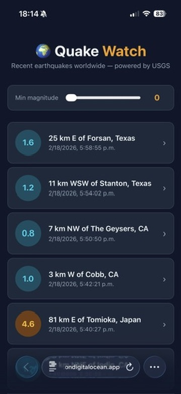
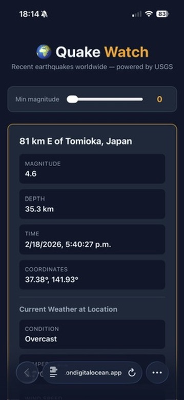

# Quake Watch

Real-time earthquake dashboard powered by USGS and Open-Meteo APIs. Built with Vite + TypeScript, deployed as a static site on DigitalOcean App Platform.

This project is a coding kata designed to demonstrate building and deploying a complete web app using [Claude Code](https://docs.anthropic.com/en/docs/claude-code).

## Features

- Live earthquake data from the [USGS Earthquake API](https://earthquake.usgs.gov/fdsnws/event/1/)
- Filter by minimum magnitude
- Click any earthquake to see details + current weather at that location via [Open-Meteo](https://open-meteo.com/)
- Fully client-side — no backend required

## Screenshots

| Earthquake list | Earthquake detail + weather |
|---|---|
|  |  |

## Getting started

```bash
npm install
npm run dev
```

## Deploy

This app is configured for DigitalOcean App Platform via `.do/app.yaml`. Push to `main` and it auto-deploys.

## License

[MIT](LICENSE)